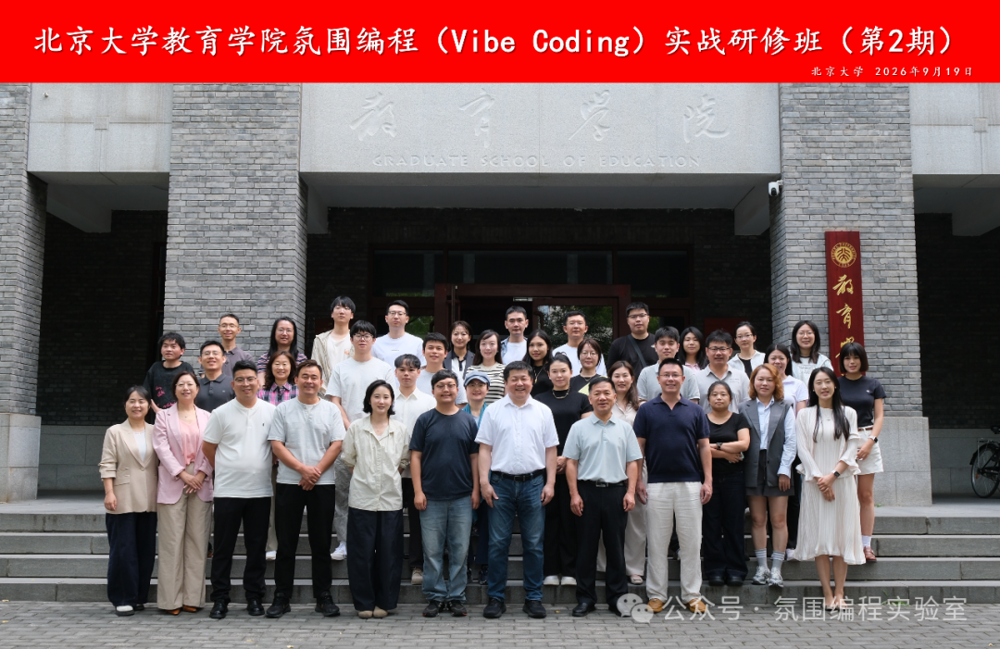

<!--
==================== 发布信息(贴 mdnice 时忽略本块)====================
主标题:氛围编程实战研修班(第2期)活动回顾
副标题:37 位学员 · 两天 · 从「用 AI 聊天」到「用 AI 做事」
摘要:9月19—20日,北京大学教育学院氛围编程实战研修班(第2期)举行。37 位来自教育、科研、政务与企业的学员,零编程基础,全程自然语言协作,完成教学游戏、数据分析、综合实战四类成果。样式模板库试排:01 Anthropic 暖色版。
封面:images/workshop-cover.png
篇幅:约 1200 字
配图清单:
  - images/workshop-cover.png     ← 全体学员合影
  - images/workshop-teacher-1.jpg ← 教学游戏专题授课
  - images/workshop-teacher-2.jpg ← 数据分析授课
  - images/workshop-class.jpg     ← 课堂现场
来源:
  - 氛围编程实验室公众号原文(mp.weixin.qq.com/s/HLpDR3QVR2rB6RSJJ1bI6w)
  - 本篇为样式模板库同题试排,非发布稿
========================================================================
-->

# 氛围编程实战研修班(第2期)成功举行

> **9 月 19—20 日 · 北京大学教育学院 · 37 位跨领域学员**
> 来自教育、科研、政务、企业的学员们,在两天实战中完成从「用 AI 聊天」到「用 AI 做事」的思维跃迁。

研修班延续<strong>「零门槛、任务驱动、成果导向」</strong>的课程理念。学员无需编程基础,全程用自然语言与 AI 协作,在真实任务中掌握人机协同的工作方法。

两天,37 人,4 类真实成果,0 行代码门槛。

## 01 · 用学习科学设计教学游戏

第一天上午,刘雨昕老师从人工智能与学习科学的基础讲起,帮助学员理解氛围编程的核心理念与工作方式。

吴腾腾老师带来「学习科学 × 用 HTML 设计教学游戏」专题,通过<strong>「讨论—规划—执行—迭代」四步协作法</strong>,以 HTML 形式搭建教育游戏。

> 做教学游戏不仅要考虑教学目标如何落位,也要让学生愿意参与其中。——学员反馈

## 02 · 数据分析与可视化实战

第一天下午,学员使用 WorkBuddy 等 AI 工具完成<strong>数据清洗、分析与交互式图表生成</strong>。工作中的表格、数据和重复任务,被带进课堂成为真实练习材料。

> 「在教务工作中设计框架,让表格动态更新,记录数据和提取数据的效率大大提高。」——现场反馈

## 03 · 从素材到一份完整成果

第二天,课程进入综合实战。学员学习从数据采集到成果汇报的完整流程,并尝试<strong>多智能体联合工作</strong>:不同智能体各司其职,协同完成文章下载、PPT 制作、公文写作和素材生产。

每位学员围绕自己的需求,完成教学游戏、数据分析、品牌海报或 SKILL 工作流,最终汇总为一份数字化学习成果。

## 04 · 两天之后,学员这样说

- <strong>关于课堂</strong>:课程并非单纯理论讲解,实操占比很高,现场可以上手体验 AI 工具。
- <strong>关于方法</strong>:对于 Prompt 有了新的理解,可以让 AI 思考解决方案,把大任务分割成小任务。
- <strong>关于突破</strong>:即使不用写代码,也可以做出各种小程序。

---

课程结束,但真实任务中的人机协作才刚刚开始。

---

> **关于本篇**
>
> - **原文出处**:氛围编程实验室 · [活动回顾原文](https://mp.weixin.qq.com/s/HLpDR3QVR2rB6RSJJ1bI6w)
> - **本篇定位**:样式模板库同题试排(01 Anthropic 暖色版),非发布稿
